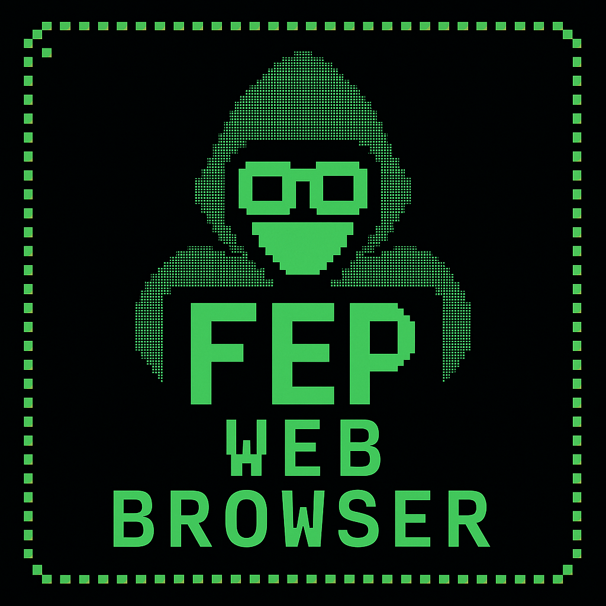
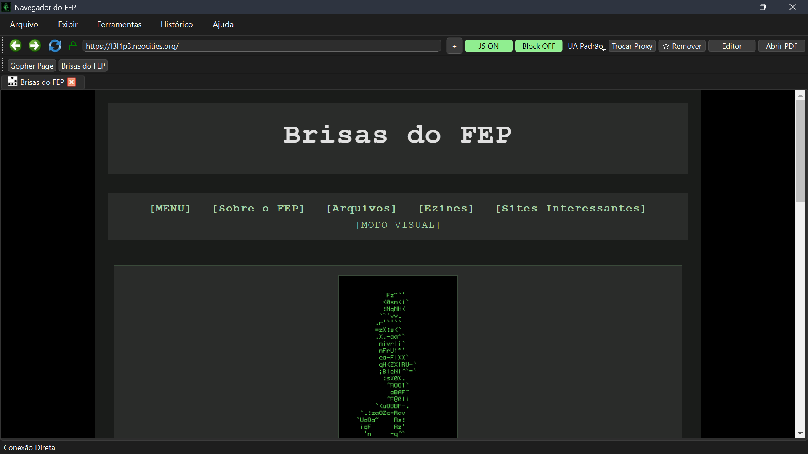
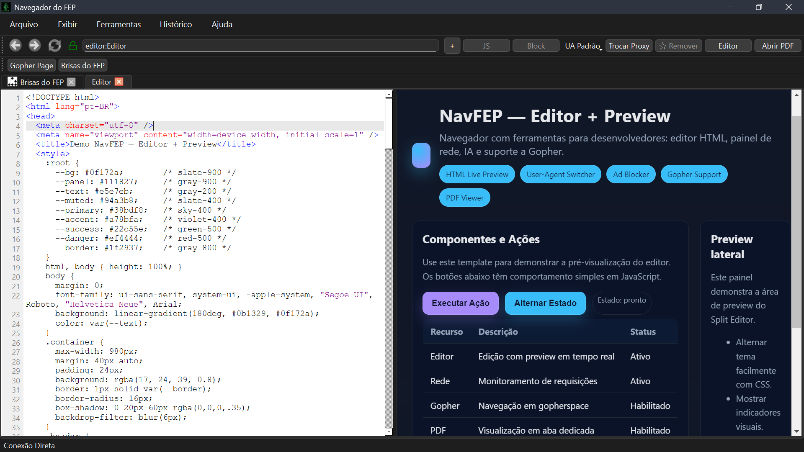
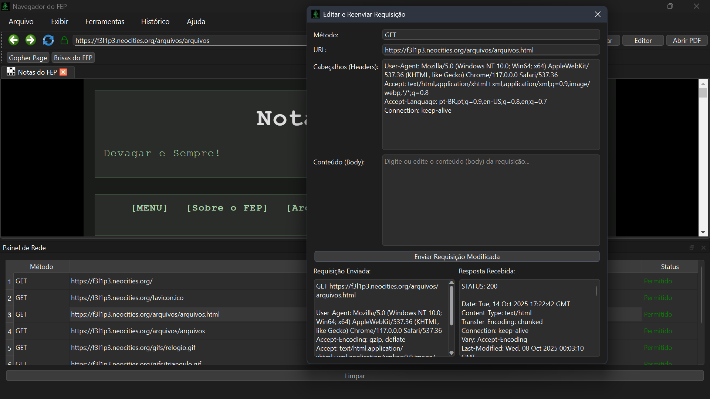
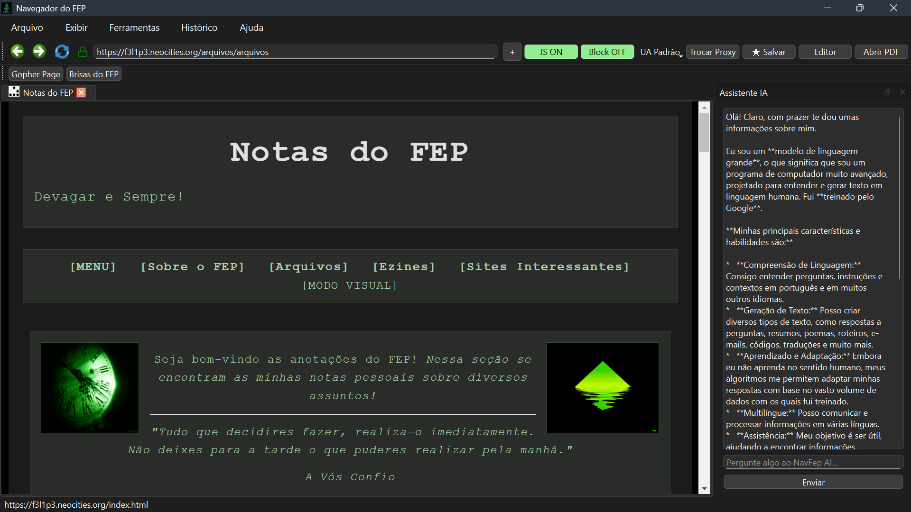
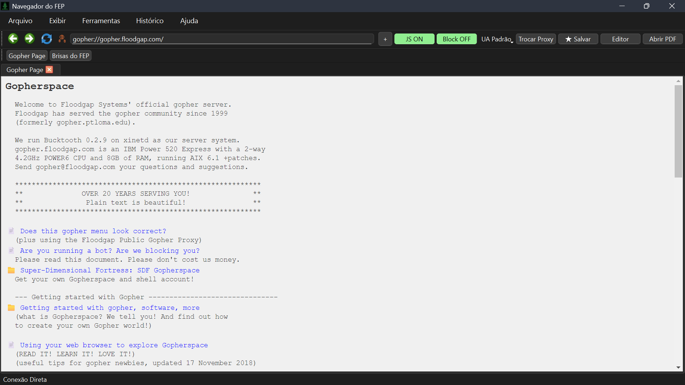
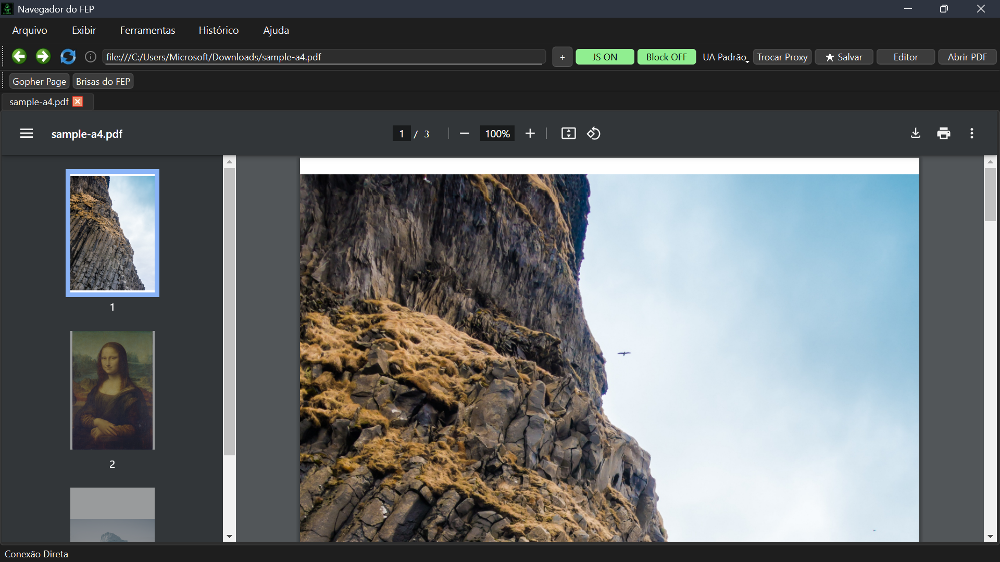

# 🌐 Navegador do FEP (NavFEP)



O **NavFEP** é um navegador web customizável construído em **Python + PySide6**, com foco em **privacidade**, **ferramentas de desenvolvedor** e **recursos modernos**.  
Este projeto nasceu como um estudo aprofundado de desenvolvimento de aplicações desktop, mas evoluiu para um navegador funcional, leve e cheio de possibilidades.

---

## ✨ Recursos Principais

### 🗂️ Navegação por Abas
- Interface moderna com suporte a múltiplas abas.  
- Gerenciamento intuitivo de sessões de navegação.  

### 📝 Editor de Código Integrado
- Editor HTML com **syntax highlighting**.  
- **Pré-visualização em tempo real** em tela dividida (Split Editor).  
- Abertura de código-fonte em abas somente leitura.  

### 🛠️ Ferramentas de Desenvolvedor
- **Painel de Rede:** monitore todas as requisições HTTP em tempo real.  
- **Tamper Data:** edite e reenvie requisições para testes avançados.  
- **User-Agent Switcher:** altere a identidade do navegador com um clique.  

### 🔒 Privacidade e Segurança
- **Ad Blocker:** bloqueio de domínios baseado em listas.  
- **Indicador de Segurança:** ícones visuais para HTTP, HTTPS e Gopher.  

### 🤖 Assistente de IA
- Painel lateral com integração de IA (Google Gemini).  
- Capacidade de **resumir páginas** e auxiliar em tarefas de navegação.  

### 🐇 Protocolos Alternativos
- Suporte nativo ao protocolo **Gopher** (`gopher://`).  
- Ícones e indicadores dedicados para diferenciar do HTTP/HTTPS.  

### 📦 Outros Recursos
- Histórico de navegação.  
- Favoritos e barra de favoritos.  
- Gerenciador de downloads.  
- Visualizador de PDFs integrado.  
- Atalhos de teclado para produtividade.  

---

## ⌨️ Atalhos de Teclado

| Atalho                | Ação                                      |
|------------------------|-------------------------------------------|
| **Ctrl+T**            | Abrir nova aba                            |
| **Ctrl+N**            | Abrir editor HTML                         |
| **Ctrl+F**            | Buscar na página                          |
| **Ctrl+U**            | Ver código-fonte da aba atual             |
| **Ctrl+H**            | Abrir histórico                           |
| **F5**                | Recarregar aba atual                      |
| **F11**               | Alternar modo tela cheia                  |
| **Ctrl+M**            | Mostrar/ocultar barra de menus            |
| **Ctrl+Shift+L**      | Mostrar/ocultar barra de navegação        |
| **Ctrl+Shift+B**      | Mostrar/ocultar barra de favoritos        |
| **Ctrl++**            | Aumentar zoom                             |
| **Ctrl+-**            | Diminuir zoom                             |
| **Ctrl+0**            | Resetar zoom (100%)                       |
| **Ctrl+Tab**          | Alternar para a próxima aba               |
| **Ctrl+Shift+Tab**    | Alternar para a aba anterior              |
| **Backspace**         | Voltar na navegação                       |
| **Shift+Backspace**   | Avançar na navegação                      |

---

## 🚀 Como Usar (Para Desenvolvedores)

0. Pré-requisitos

	* Python 3.10 ou superior instalado.
	* Git (para clonar o repositório).
	
1. Clone este repositório:  
   ```bash
   git clone [https://github.com/felipeandrian/NavFEP-Browser.git](https://github.com/felipeandrian/NavFEP-Browser.git)
   cd NavFEP-Browser
   ```
2. Crie e ative um ambiente virtual:  
   ```bash
   python -m venv venv
   source venv/bin/activate   # Linux/macOS
   .\venv\Scripts\activate    # Windows
   ```
3. Instale as dependências:  
   ```bash
   pip install -r requirements.txt
   ```
4. Execute o navegador:  
   ```bash
   python main.py
   ```

---
---

### Configurar a Chave de API (para o Assistente IA)

O assistente de IA utiliza a API do Google Gemini. Para ativá-lo, você precisa de uma chave de API.

1.  Crie uma chave de API no [Google AI Studio](https://aistudio.google.com/app/apikey).
2.  Na pasta do projeto, crie um arquivo chamado `navfep_config.json`.
3.  Abra o `navfep_config.json` e substitua `"SUA_CHAVE_DE_API_DO_GEMINI_VEM_AQUI"` pela chave que você gerou. O arquivo ficará assim:

    ```json
    {
        "api_key": "sua-chave-real-aqui-xxxxxxxxxxxx"
    }
    ```
> **Nota:** O navegador também pedirá a chave na primeira vez que você usar a IA, caso não crie esse arquivo.

---

## 🖼️ Screenshots

### 🌐 Página Inicial
Uma visão geral da interface principal do NavFEP.


### 📝 Editor HTML em Ação
Edição de código com pré-visualização em tempo real (Split Editor).


### 📡 Painel de Rede
Monitoramento de requisições HTTP em tempo real.


### 🤖 Assistente de IA
Painel lateral com integração de IA para resumo e auxílio contextual.


### 🐇 Navegação em Gopherspace
Exemplo de acesso a conteúdo via protocolo Gopher.


### 📄 Visualizador de PDF
Visualização de documentos PDF diretamente em uma aba.


---

## 📜 Licença

Este projeto é licenciado sob a **Licença MIT**.  
Consulte o arquivo [`LICENSE`](LICENSE.txt) para mais detalhes.

---

## 👨‍💻 Autor

**Felipe Andrian Peixoto**  
Desenvolvido com foco em produtividade, aprendizado e experimentação.


